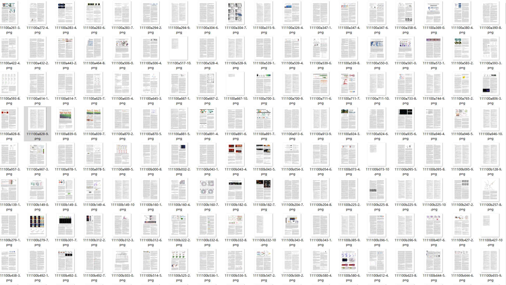
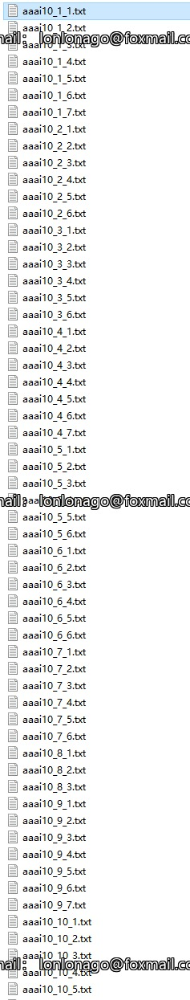
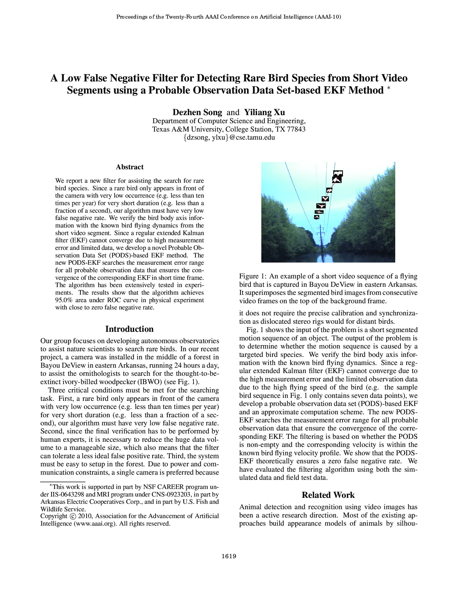
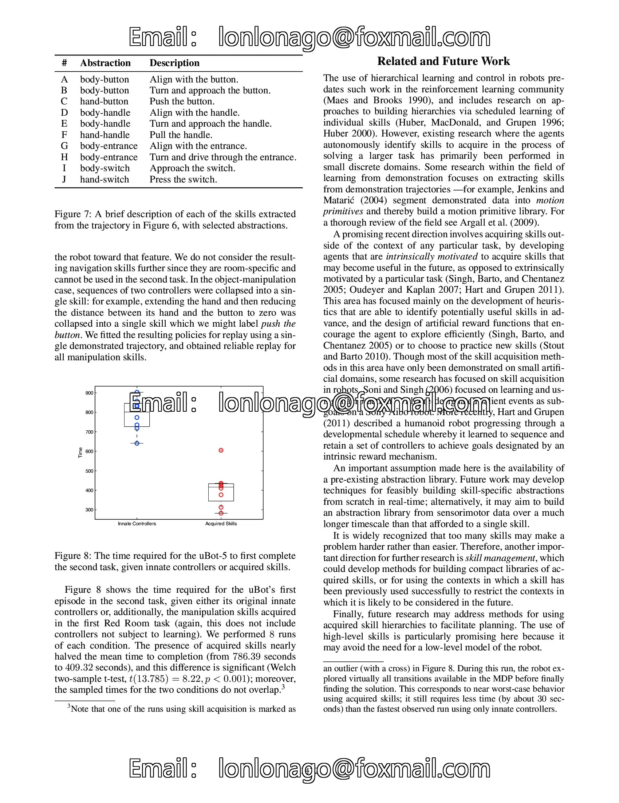
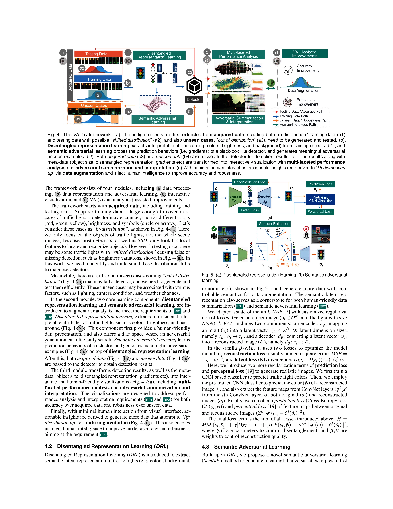
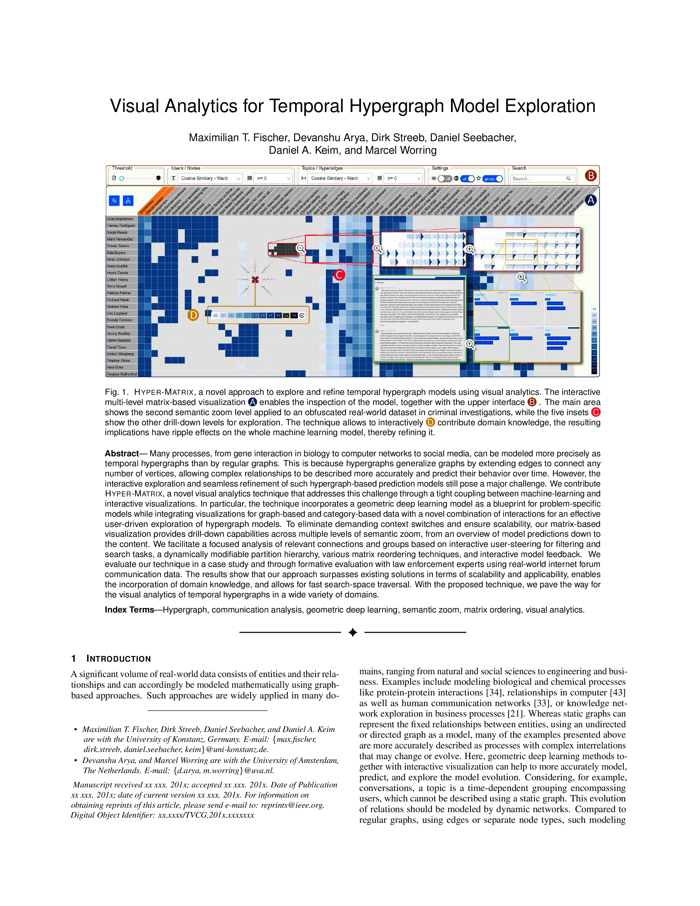

## Body

文档布局分割数据集

含作者原文档

总页数 / 图片数：约 6303 页（单页 1 张图，即 6303 张标注图）
--------CS-150x（扩展自经典 CS-150 数据集）：1176 页
--------ACL300（ACL 选集）：2508 页
--------VIS300（IEEE 可视化会议）：2619 页

标注类别：9 类语义区块（摘要（Abstract）算法（Algorithm）作者（Author）正文（Body Text）说明（Caption，图表说明文字）方程（Equation）图表（Figure/Table）标题（Title））

格式：PDF 页面转图（JPG格式） + 对应布局标注（TXT格式）

电子虚拟产品售出概不退换

## Images

Here is a pay link on Stripe ( https://buy.stripe.com/3cs8yP7sY87d0vu9AB ). Please contact me lonlonago@foxmail.com after funding $89, and I will send you a complete data files , thank you!

